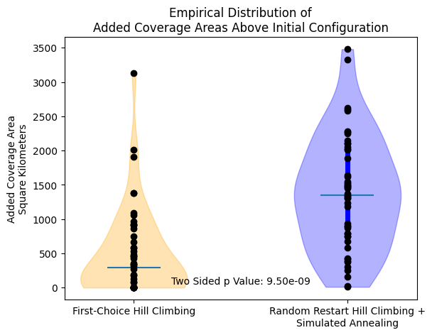
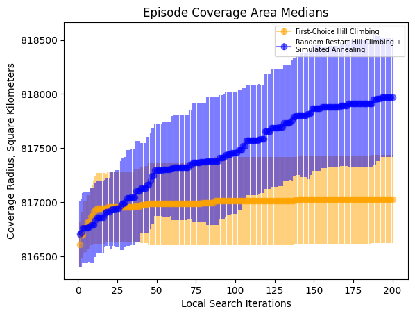

# Satellite Coverage Analysis

The repository contains a set of tools aimed at optimizing the placing of the Starlink constellation in order to achieve maximum area coverage. Using Two-Line Element data, geographic transformations, and spatial data processing, the project analyzes and optimizes the unique area covered by the satellite network.

## Table of Contents

- [Project Overview](#project-overview)
- [Approach](#approach)
- [Getting Started](#getting-started)
- [Installation](#installation)
- [Usage](#usage)
- [Results](#results)

---
## Project Overview

Low Earth Orbit (LEO) satellites operate at altitudes between 100-1,200 miles above Earth's surface, enabling global communications with reduced signal latency and higher data transfer speeds compared to traditional satellites. However, these satellites face certain limitations - their relatively short operational lifespan of approximately 7-10 years, requiring frequent replacements to maintain network coverage.  

The SpaceX Starlink network is currently the most extensive and technologically advanced satellite constellation in low earth orbit, offering high-speed, low-latency broadband internet worldwide. This project addresses the optimization of satellite placement in the Starlink constellation to achieve maximum area coverage.

## Approach

1. Hill Climbing:  
This is a local search algorithm that helps find the best solution to a given problem. The process is analogous to climbing a hill where you continually seek to improve your position until you reach the peak, or maxima.  
Algorithm:
    - Initial State: Start with an arbitrary or random solution.
    - Neighboring States: Identify neighboring states of the current solution by making small adjustments.
    - Move to Neighbor: If one of the neighboring states offers a better solution (based on an objective function), move to this new state.
    - Termination: Repeat this process until no neighboring state is better than the current one or the maximum number of iterations have been reached. At this point, you’ve reached a local optimum.

2. Simulated Annealing:   
This algorithm draws inspiration from metallurgical processes, where metals are heated to a high temperature and then gradually cooled to remove defects and optimize their crystal structure.  
Algorithm:
    - Initial State: Start with an arbitrary or random solution.
    - Neighboring States: Identify neighboring states of the current solution by making small adjustments.
    - Move to Neighbor: If one of the neighboring states offers a better solution (higher energy, based on an objective), move to this new state. If not, then compute the probability of accepting a low energy solution using:  
    $e^{\frac{\Delta E}{T}} < random (0, 1)$  
    where ${\Delta E}$ represents the difference in energy between the current and the neighbouring state, and $T$ is the temperature. $T$ decays over time using a decay factor $d \in (0,1)$.
    - Termination: Repeat this process until no neighboring state is better than the current one or the maximum number of iterations have been reached. At this point, you’ve reached a local optimum.

## Getting Started

To get started with this project, ensure you have Python installed. This project requires Python 3.9 or 3.10. You can download and install Python for:

`windows`: Visit the [Python](https://www.python.org/downloads/) website and download the installer.

`macOS`: 
```bash
# Using Homebrew
brew install python@3.9
```
`Linux`:  
Most distributions come with Python pre-installed. If not, use your package manager: 
```bash
# Ubuntu/Debian:
sudo apt-get install python3.9
```
```bash
# Fedora: 
sudo dnf install python3.9
```

## Installation

1. Clone the repository:
    ```bash
    cd /your/preferred/location/
    git clone https://github.com/CS-5100/Satellite.git
    cd Satellite/
    ```
    > **Note**: GitHub has removed [password-based authentication](https://docs.github.com/en/get-started/getting-started-with-git/about-remote-repositories#cloning-with-https-urls) when cloning with HTTPS URLs. Instead, use **GitHub CLI** or **personal access tokens (PAT)** for authentication when prompted.

2. Install dependencies:
    ```bash
    pip install -r requirements.txt
    ```
    Installs required librabries to preprocess the TLE data and run the local search algorithms. 
    
    > **Note**: It is recommended to use a [virtual environment](https://docs.python.org/3/library/venv.html) to install the libraries to prevent any discrepancies with the existing libraries on your system.

## Usage

### Data Preprocessing

The `geodataframe_processing.py` file handles several critical preprocessing tasks related to map data and satellite positions. Below are the key functions and their purposes:

#### 1. Loading Map Data
We load land and ocean map data (stored in the `data/map_data/` directory) and convert it to a GeoDataFrame with a specified Coordinate Reference System (CRS) which is essential for analyzing satellite coverage.  

**Usage:**  
```python
land_map = load_map_data("ne_10m_land_scale_rank.zip", EPSG=6933)
ocean = load_map_data("ne_10m_ocean_scale_rank.zip", EPSG=6933)
```

#### 2. Loading existing Satellite Data
We fetch existing Starlink Satellite in TLE (Two-Line Element) format from CelesTrak and convert it into a GeoDataFrame, projecting the data into the specified CRS.

**Usage:**
```python
existing_satellites = load_existing_satellites(EPSG=6933)
```

#### 3. Generate New Satellites
We use a function to generate the number of additional satellites to be potentially launched to orbit. The `generate_new_satellites` function creates a new set of randomly positioned satellite candidates and returns them as a GeoDataFrame. 

**Usage:**
```python
new_satellites = generate_new_satellites(num_satellites=60)
```

#### 4. Perturb Satellite Positions
We perturb the positions of new satellites by a random amount up to a specified maximum shift (in kilometers). The function ensures that satellites stay within valid geographic boundaries and adjusts their coordinates accordingly. This is done to find neighboring configurations that might improve coverage area.

**Usage:**
```python
perturb_positions(new_gdf, new_satellite_column, max_shift_km=500)
```

#### 5. Calculate Coverage Area
We then calculate the area covered by the set of satellites. This is or objective function. The local search algorithms implemented aim to maximize the area covered.

**Usage:**
```python
coverage_area = calculate_land_coverage(satellites_gdf, land_map)
```

### Local Search
The `localSearch.py` performs the hill climbing algorithm and the `simulated_annealing.py` performs the simulated annealing algorithm discussed above to find optimal satellite placement. 

**Usage:**
```python
# running hill climbing algorithm
python localSearch.py

# running simulated annealing
python simulated_annealing.py
```

## Results
The `hillclimbing_averagecoverage.py` and `simulatedannealing_averagecoverage.py` measure the average coverage area added using the hill climbing and simulated annealing algorithms respectively.



The above plot shows the added coverage area above initial configuration. As expected, the simulated annealing adds more area in comparison to the hill climbing, although the addition is only about 3500 sq. km.



The above plot demonstrates how the added coverage area varies with the number of iterations. As the number of iterations increase, coverage area tends to increase, but this is computationally expensive since Starlink has about 6000 satellites that are currently in orbit.